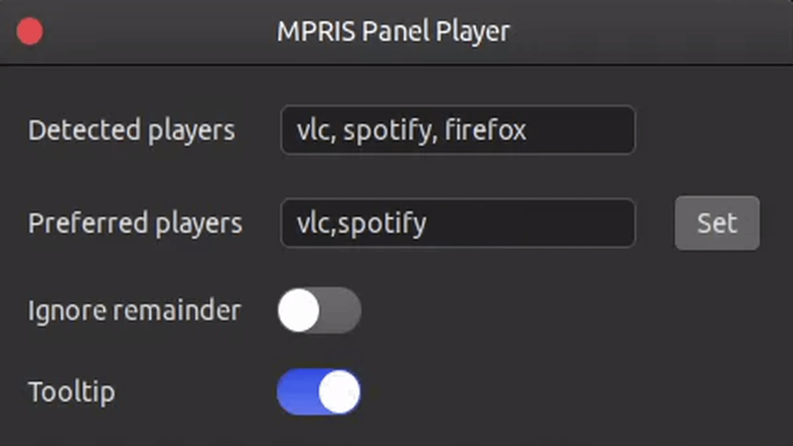

# gnome-shell-extension-mprispanel

Adds controls to the gnome panel for MPRIS enabled media players

Uses DBus to interact with all available media players. A 'smart-switching' technique is leveraged to decide which player to control.

## Preferences

| Field              | Description                                           |
|--------------------|-------------------------------------------------------|
| Detected Players   | A list of all currently running MPRIS players, entries listed here can be used in 'Preferred players'|
| Preferred Players  | For when more than one player is running. A comma seperated list of MPRIS players, the first MPRIS player will be selected from left to right|
| Ignore remainder   | Ignore MPRIS players not explicitly specified in 'Preferred players'     |
| Tooltip | Display current MPRIS player on widget hover|

## Detailed Description

**mprispanel** works by polling DBus on a timer for currently running applications with an exposed MPRIS interfaces. Therefor it is application agnostic and will detect any application that exposes such an interface.

In situations where there is more than one running application with an MPRIS interface, the 'Preferred players' option can be utilised to make a priority call on which player to select.

Users can specify a comma seperated list of 'Preferred players' to control. **mprispanel** will select the first available player it can find from left to right. After it has exhausted the 'Preferred players' list, it will then select from any remaining players unless 'Ignore remaining' is set.

